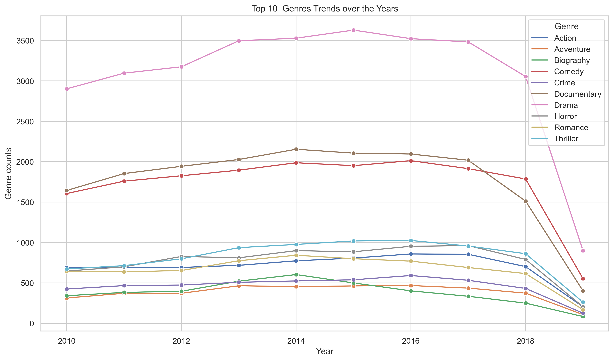
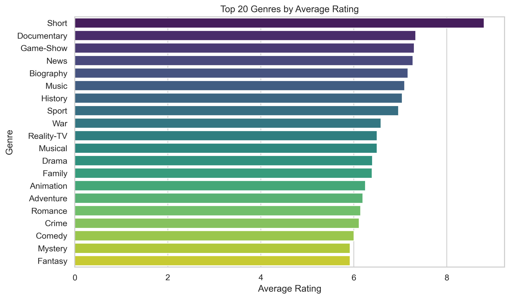
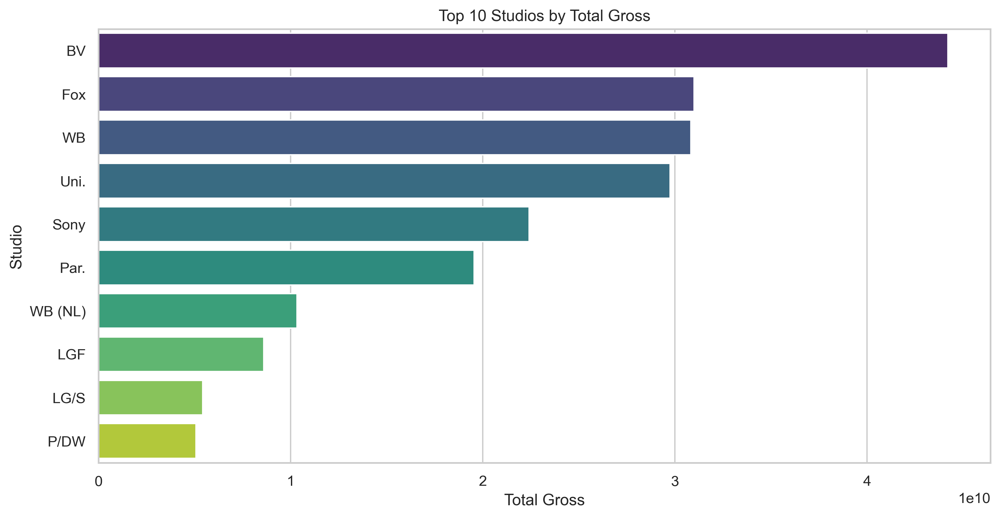

# <h1 style="text-align: center;">Identifying Top Films Using Box Office Data

## Project Overview
Our company is exploring opportunities in the entertainment industry, specifically film production and distribution. To make data-informed decisions about which genres to invest in, this project analyzes movie datasets the best performing films.

By analyzing trends, the project aims to guide strategic investment decisions in genre selection, helping reduce risk and increase the likelihood of success in the competitive film market.

## Business Understanding
As part of its diversification strategy, our company is expanding into the entertainment industry, with a focus on film production. To ensure a strong entry into this competitive market, the company must make data-driven decisions on which films to prioritize.

By analyzing the movie datasets this project aims to uncover patterns that highlight films with consistent audience appeal. These insights will help guide the head of the company's new movie studio in selecting films that align with market demand, reduce investment risk and increase the likelihood of commercial success.

#### Key Business Questions
 - Which films have the most production over the years?
 - Which movie genres have the highest average ratings?
 - Who are our competitors?
 - Do movies that perform domestically perform internationally?

 ## Key Data Science Steps
 1. Data Explooration: 
 2. Data Cleaning: 
 3. Exploratory Data Analysis: 
 4. Visualization: 
 5. Interactive Dashboard: 

## Data Understanding and Analysis
The data used in this project comes from two popular film industry sources: `IMDb` and `Box Office Mojo`.

The primary dataset is based on IMDb movie records, containing fields such as:
 - `movie_id`
 - `primary_title`
 - `original_title`
 - `start_year` 
 - `genres`
 - `runtime_minutes`
 - `average_rating`
 - `numvotes`

The second dataset is the Box Office Mojo and has the following columns:
 - `title`
 - `studio`
 - `domestic_gross`
 - `foreign_gross`
 - `year`

 #### Key Visualizations
    1. Genre Trends over the years  - Shows top produced movies over the years

    2. Top films by ratings  - Shows top performing films by ratings.

    3. Top Competitors by revenue  - Shows top studios with domestic and global reach.

## Interactive Dashboard

Click to view the dashboard: [Film Insight Dashboard](https://public.tableau.com/views/FilmInsightsDashboard/Boxoffice?:language=en-US&:sid=&:redirect=auth&:display_count=n&:origin=viz_share_link)

# Conclusion
This analysis reveals key trends in film production and performance:

Drama, Documentary, and Comedy are the most frequently produced genres, showing strong audience interest and lower production risk.

Short films and factual content like Documentaries and News receive the highest average ratings, suggesting viewers value concise and informative content.

There is a strong positive correlation (0.79) between domestic and international revenue, meaning successful local films often perform well globally.

## Repository Structure
 -  `Data` folder     -   Raw datasets
 - `Images` folder    -   Visuals and tableau dashboard 
 - `Presentation pdf` -   Project presentation 
 - ` student.ipynb`  -   Jupyter notebook 
 - ` README.md`       -    Project overview and navigation
 -  `.gitignore`      -    Lists large/sensitive files to exclude from Git
 - `clean_data.xlsb`       -    clean data after cleaning

## Technologies Used
- Python (`pandas`, `matplotlib`, `seaborn`)
- Jupyter notebook
- Tableau Public
- Git & GitHub

